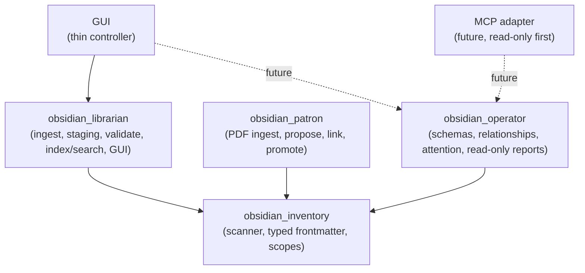

# 70 — Work Management Architecture (`obsidian_operator`)

Status: Proposed (Phase 1 foundation). Supersedes nothing; extends the
Librarian/Patron architecture without changing their responsibilities.

This document describes how the existing `obsidian-librarian` toolchain evolves
into a local-first **work-management layer** over a *separate* Obsidian
management vault, without weakening the existing safety model.

---

## 1. Purpose and scope

The toolchain today converts raw files into reviewable notes and searches them.
The next layer answers management questions over a dedicated vault:

- What needs my attention?
- Who owns this?
- What is blocked?
- What changed since my last review?
- What am I waiting on?

This layer is called `obsidian_operator`. It owns **operational semantics**
(projects, people, tickets, meetings, actions, relationships, attention
signals). It does **not** own ingestion, parsing, indexing, or PDF handling.

Phase 1 is deliberately read-only. No operator command mutates the vault.

---

## 2. Current architecture (as found)

Three packages under `src/`, one shared library and two binaries:

```
src/
├── obsidian_inventory/   # SHARED read-only scanner (single parser)
│   ├── scanner.py        # build_index, IndexRecord, scopes, frontmatter read/write
│   └── __init__.py       # public API surface
├── obsidian_librarian/   # read-only binary + GUI + staged ingest
│   ├── cli.py            # index | search | ask | enrich | review-quality | gui
│   ├── ingest.py, vault.py, validators.py, note_quality.py, review_report.py
│   ├── pdf_*.py          # deterministic PDF classifier/validation paths
│   └── gui/              # server.py, service.py, static/index.html
└── obsidian_patron/      # write-capable PDF binary
    ├── cli.py            # ingest | propose | link | unmatched | status | promote | unpromote
    ├── safety.py         # ensure_under + write-contract validation
    └── promotion.py      # staging/trusted promotion ledger
```

**Safety contract (non-negotiable, from `PROJECT_INSTRUCTIONS.md` and
`.specify/memory/constitution.md`):**

1. Never delete a vault file.
2. Never modify trusted-hub note content (frontmatter status fields only, on promotion).
3. Write containment: librarian → `90_Staging/` only; patron → `91_Ingestion/` then explicit promotion.
4. No autonomous note creation; wikilinking is match-only.
5. LLM output is never vault evidence; it stays in proposals/`Enriched/`.
6. Human-gated promotion.
7. Deterministic-first; LLM only enriches.
8. One shared scanner (`obsidian_inventory`).
9. Never claim a check passed unless it ran.

**Dependency direction today:** `obsidian_inventory` is the foundation; both
binaries import it. There is no cycle.

**Vault zones (engineering vault):** trusted hubs (`10_DSP-Eurorack/`,
`20_Power-Electronics/`, `30_EMC/`, …), plus `90_Staging/` and `91_Ingestion/`.
`scope_for_path` in `scanner.py` hardcodes those two review zones.

---

## 3. Extension points and architectural debt

Identified while assessing the repository. These are the seams Operator uses and
the debt it must not amplify.

| Item | Location | Impact on Operator |
|---|---|---|
| Frontmatter reader is **lossy** — `extract_frontmatter` returns `dict[str, str]`, flattens YAML block lists into comma strings, drops nested maps | `obsidian_inventory/scanner.py` | Operator's `people`, `systems`, and external-ref fields would be corrupted. Requires a typed reader. |
| A **second, naive frontmatter parser** exists | `obsidian_librarian/validators.py::parse_frontmatter` | Violates Golden Rule 8. Operator must reuse the inventory reader, not add a third. |
| **Scopes are hardcoded** to `90_Staging`/`91_Ingestion` | `scanner.py::scope_for_path`, `VALID_SCOPES` | Management folders are not a scope. Operator filters the `vault` scope by frontmatter `type` instead of adding scopes. |
| GUI service holds workflow logic | `obsidian_librarian/gui/service.py` | Future GUI must call Operator services, not duplicate rules. |
| `IndexRecord` is a frozen dataclass with a fixed field set | `scanner.py` | Extend with an optional defaulted field to carry typed frontmatter; do not fork the record. |

**Decision (see §9):** extend `obsidian_inventory` with a typed frontmatter
reader and attach it to `IndexRecord`; do **not** add a second scanner and do
**not** add management scopes in Phase 1.

---

## 4. Target architecture



**Dependency rules**

- `obsidian_inventory` depends on nothing in the project.
- `obsidian_operator` depends **only** on `obsidian_inventory`. It must not
  import `obsidian_librarian` or `obsidian_patron`.
- `obsidian_librarian` and `obsidian_patron` keep their current dependencies.
- GUI and MCP are **consumers**. Operator never imports them.
- No cycles. Dependency direction is one-way toward the foundation.

---

## 5. Package responsibilities

### `obsidian_inventory` (extended)

- Read vault structure; parse frontmatter; aliases; headings; tags; wikilinks; index; search.
- **New in this phase:** `read_frontmatter_typed(content)` returning a
  YAML-faithful mapping (lists/nested preserved), and an optional
  `frontmatter_typed` field on `IndexRecord`.
- Knows how to *identify* operator `type:` values but contains **no** business logic.

### `obsidian_librarian` (unchanged responsibilities)

- Raw inbox ingestion, staging, validation, quality review, source transformation,
  optional enrichment, index/search CLI, GUI.
- Does not become the team/project management engine.
- May later consume Operator schema detection for validation; Operator must not depend on it.

### `obsidian_patron` (unchanged)

- Specialized document/PDF ingestion, proposal, linking, promotion. Not folded into Operator.

### `obsidian_operator` (new)

- Operational schema models (project, person, ticket, meeting, action).
- Relationship resolution over the shared index.
- Stale/attention detection and rollups.
- Read-only list/show queries (Phase 1) and, later, generated views and safe state updates.
- Exposes the same retrieval functions the CLI, GUI, and MCP adapter will call.

### GUI (evolves later)

- Thin controller: navigation, dashboards, entity detail, confirmation gates.
- Reuses Operator services; no GUI-only business rules.

### MCP adapter (future)

- A read-only-first translation layer over Operator retrieval functions.
- Cannot change vault state until an explicit, spec'd mutation policy exists.

---

## 6. Authoritative-system boundaries

Obsidian is the **management and context layer**, not the authoritative
transactional system for everything.

| Concern | Authoritative system (external) | WorkSync/Obsidian role |
|---|---|---|
| Ticket state | ServiceDesk Plus | Reference / snapshot / escalation record |
| Work tracking | Planner or Wrike | Reference where appropriate |
| Meeting transcripts | Krisp (or similar) | Summarized meeting record + decisions/actions |
| Communication | Email | Links and follow-up records |
| Vault knowledge | Obsidian | Canonical local notes |

**External reference modes** (schema field `sync_mode`): `reference`,
`snapshot`, `managed-locally`, `generated`. Phase 1 stores these as metadata and
does **not** implement synchronization. No adapter may own vault models; adapters
translate into operator schemas at the edge.

---

## 7. Canonical vs generated data

- **Canonical (human-owned):** project, person, ticket, meeting, action notes —
  hand-written or edited by the user. Operator reads them; Phase 1 never writes them.
- **Derived (generated):** Today/Team/Projects/Tickets views, attention queues,
  rollups, staleness reports. These are reproducible from canonical notes and are
  rendered as reports or (later) into a `Views/` area marked as generated.
- **External state:** never copied wholesale; referenced via `source_system`,
  `external_id`, `external_url`, `sync_mode`, `last_synced`.
- **Rule:** generated artifacts are never the source of truth; if a generated
  view disagrees with a canonical note, the canonical note wins.

---

## 8. Vault model (separate management vault)

Operator runs against a **separate management vault**, distinct from the
engineering vault that holds the `10_/20_/30_` hubs. Because it is separate,
there is **no coordinate collision** with existing numeric hub names.

**Principle:** folders are *convention*; frontmatter `type:` is *canonical*.
Operator filters the `vault` scope by `type`, so folder layout can evolve without
changing code.

Recommended management vault layout (convention, not enforced in Phase 1):

```text
00_Inbox/
Projects/<Project>.md
Team/People/<Person>.md
Team/1-on-1s/
Operations/Tickets/<Ticket>.md
Operations/Applications/
Meetings/
Management/Daily/
Management/Weekly Reviews/
Management/Decisions/
Management/Risks/
Views/            # generated; never hand-edited
90_Staging/       # optional, if the same tooling is reused
```

- A ticket note represents a **manager-significant** ticket, snapshot, escalation,
  or follow-up — **not** a full mirror of ServiceDesk Plus.
- A person note is a canonical identity/profile plus *rollups* (assignments,
  follow-ups, recent 1:1s). Rollups are generated, not hand-maintained.
- No database. Markdown + YAML frontmatter remains the local data format.

---

## 9. Decisions

Recorded here because the repository has no separate ADR directory.

1. **Keep the name `obsidian_operator`.** It collides only with the unrelated
   `SB_OS/skills/os-operator` *skill* (an autonomous vault-maintenance agent for
   the Second Brain OS suite). The Python package namespace stays unambiguous.
2. **Extend `obsidian_inventory` with a typed frontmatter reader** rather than
   adding a second parser (Golden Rule 8). Keep the existing `extract_frontmatter`
   byte-compatible for current callers.
3. **No new search scopes in Phase 1.** Operator consumes the `vault` scope and
   filters by `type:`.
4. **Separate management vault.** No collision with engineering hubs; folder
   structure is convention.
5. **No database.** Filesystem-only, consistent with `docs/20_dev_stack.md`.
6. **Read-only Phase 1.** No write paths, so no new containment surface yet. Any
   future operator write must be spec'd (constitution Principle VI) and
   containment-tested.

---

## 10. Safety model

Phase 1 inherits the safety contract unchanged:

- Read-only: operator commands write nothing.
- Determinism: stable ordering, sorted output, no network/LLM/embeddings.
- Provenance: every entity carries its source path; derived output cites it.
- Uncertainty: malformed notes and unresolved links are reported, never guessed.
- No autonomous mutation. Future state updates (e.g. marking an action complete)
  must go through an explicit, reviewable command with a visible change set and a
  staging-first default, matching the Patron promotion pattern.

---

## 11. How Operator interacts with the rest

| Component | Interaction |
|---|---|
| Inventory | Operator builds its entity view from `build_index(vault, "vault")` + typed frontmatter. No re-parsing. |
| Librarian | No code dependency. Operator may later be called *by* librarian validation to recognize operator note types. |
| Patron | None. A PDF promoted into a management vault can become a meeting/decision note, but via normal vault notes, not a direct dependency. |
| GUI | Future thin controller calling Operator services. |
| MCP | Future read-only adapter over Operator retrieval functions. |
